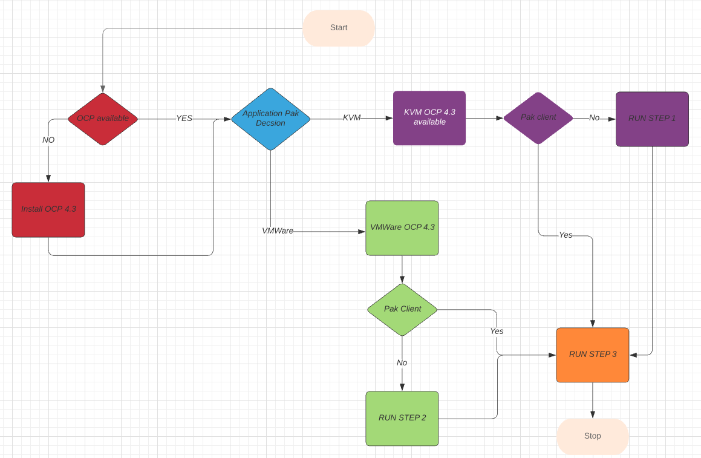
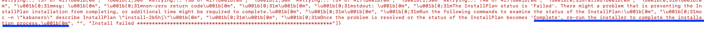

Installing Application Pak  4.X 
===============================


The guide will get you up and running with Application Pak 4.x. on OCP 4.3. The setup assumes OCP 4.3 is already installed and administration rights access available to deploy the Application Pak.
The guide assumes OCP 4.3 installed using the same GitHub repository if this is not the case, please make sure the OCP worker node capacity is matched following table:  

## Hardware requirements

| Software      | vCPU   | Mem  | HDD | Node
| ------          | ------ |----  | --- | ------ |
| Kabanero Enterprise | 8  | 20 | 25 | 2|
| Transformation Advisor | 2  | 8 | 8 |  |
| Application Navigator |  1 | 3 | 3 |  |
| Total |  12 | 24.5 | 36 | 2 |


Deploying Application Pak
------------------------------------

The installation support two options VMWare or KVM install, and both will deploy VM guest if required. The VM guest called PakHelper node act as a client to install Application Pak. There is no reason to deploy a VM guest client if you already have VM guest centos 7 OS available in the same network. If this is already in place, please skip the option one and two, but in case you don't have VM guest available, please execute both option 1 or 2 and 3. Please follow the Flowchart to figure out which steps need to be performed on your environment.


 
Option One (KVM Only)
--------------------
--------------------

### Prepare the Host KVM ####

Login to the Host KVM as root and execute the following commands.
```
cd /opt
git clone https://github.com/fctoibm/apppak4.x.git
cd /opt/apppak4.x
```

Edit the [kvmvars.yaml](./kvmvars.yaml) file with the IP addresses that will be assigned to the pakhelper node. The IP addresses need to be right since they will need to access the OpenShift servers.
Edit the [hosts](./hosts) file vmguest section to match the pakhelper node information. This should be similar to kvmvars.yaml file


> **NOTE:** If the setup is performed on KVM host infrastructure, then delete the iptables forward rules by issuing following commands on KVM host server

```
iptables-save > /root/savedrules_pak.txt
iptables-restore < /root/savedrules.txt
```

### Execute the Playbook ###
 
This play book will create Application Pak Helper VM guest on KVM Host. The new VM will access the OCP servers and  public network access to download yum packages.

> **NOTE:** If the client is already available, please proceed to option 3.

```
Run the playbook to setup the kvmhost
ansible-playbook -v -e @kvmvars.yaml play.yaml -t kvm --limit "kvmhost"
```


Option Two (VMWare Only)
-----------------------
-----------------------
Login to the client VM as root and execute the following commands.
```
cd /opt
git clone https://github.com/fctoibm/apppak4.x.git
cd /opt/apppak4.x
```

Edit the [vmwarevars.yaml](./vmwarevars.yaml) file with the IP addresses that will be assigned to the pakhelper node. The IP addresses need to be right since they will need to access the OpenShift servers.
Edit the [hosts](./hosts) file vmguest section to match the pakhelper node information. This should be similar to vmwarevars.yaml file


### Execute the Playbook ###
 
This play book will create Application Pak Helper VM guest on VMware Host. The new VM will access the OCP servers and  public network access to download yum packages.


> **NOTE:** If the client is already available, please proceed to option 3.

```
Run the playbook to setup the kvmhost
ansible-playbook -v -e @vmwarevars.yaml play.yaml -t vmware --limit "vmwarehost"
```


Option Three (Clinet Only)
--------------------------
--------------------------
Depending on the above flow the -e @<input variable YOUR_VARS.YAML> could be vmwarevars.yaml or kvmvars.yaml

```
ansible-playbook -vv -e @YOUR_VARS.YML play.yaml -t setupapppak --limit "vmguest"

```
> **NOTE:**: If the install fails and shows the following message in the end,  :red_circle: "Once the problem is resolved or the status of the InstallPlan becomes 'Complete', re-run the installer to complete the installation process."  :red_circle: Then please execute the following command. The error shows install didn't finish but timed out, and by issuing the command the install will start from where it left off earlier. 



```
ansible-playbook -v -e @YOUR_VARS.YML  play.yaml -t retry --limit "vmguest"

```


##### Update IP tables on KVM Host to access OpenShift URL #####


On KVM Host run the following commands:
```
iptables-restore < /root/savedrules_pak.txt
```


After Application Pak Installation 
------------------------------------
Follow the [After installation](https://www.ibm.com/support/knowledgecenter/SSCSJL_4.x/install-icpa-cli.html/ "After installation link")  section to verify the install 


